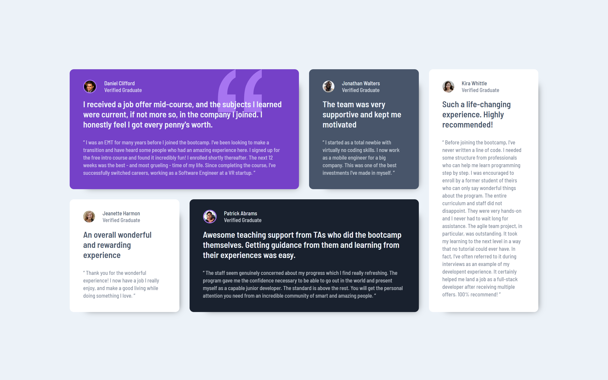

# Frontend Mentor - Testimonials grid section solution

This is a solution to the [Testimonials grid section challenge on Frontend Mentor](https://www.frontendmentor.io/challenges/testimonials-grid-section-Nnw6J7Un7). Frontend Mentor challenges help you improve your coding skills by building realistic projects. 

## Table of contents

- [Overview](#overview)
  - [The challenge](#the-challenge)
  - [Screenshot](#screenshot)
  - [Links](#links)
- [My process](#my-process)
  - [Built with](#built-with)
- [Author](#author)

## Overview

### The challenge

Users should be able to:

- View the optimal layout for the site depending on their device's screen size

### Screenshot

##### Desktop Design

##### Mobile Design

### Links

- Solution URL: [https://github.com/doomware/testimonial-section](https://github.com/doomware/testimonial-section)
- Live Site URL: [https://doomware.github.io/testimonial-section](https://doomware.github.io/testimonial-section)

## My process

### Built with

- CSS custom properties
- Flexbox
- CSS Grid
- Mobile-first workflow
- [React](https://reactjs.org/) - JS library
- [SCSS](https://sass-lang.com/) - For styles

## Author

- Frontend Mentor - [@doomware](https://www.frontendmentor.io/profile/doomware)
- Twitter - [@d00mwar3](https://twitter.com/d00mwar3)
